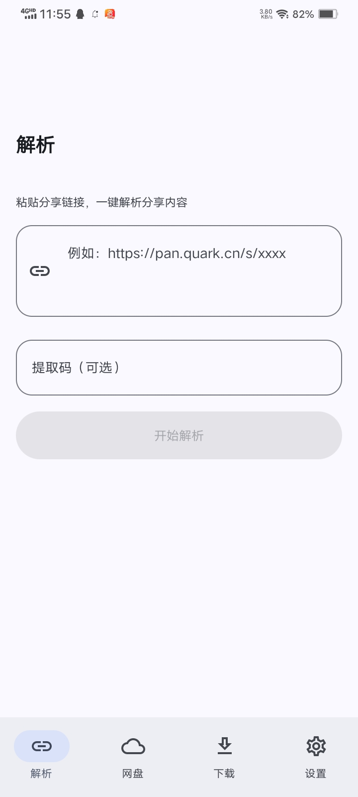
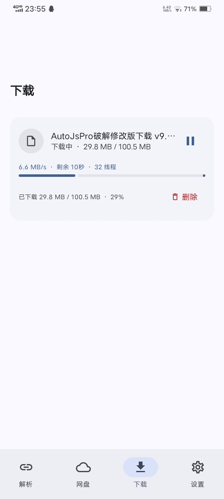
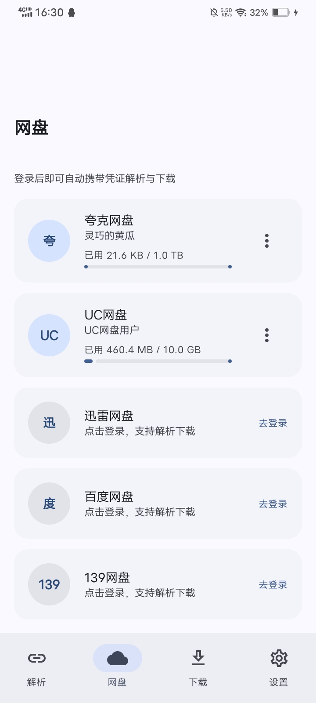

# 星辰助手

一款面向 Android 的多网盘文件管理与分享链接解析工具，支持账号管理、文件浏览、链接解析、转存与下载任务管理。

> 本项目仅用于学习、研究和管理本人有权访问的文件。请遵守当地法律法规、网盘服务条款与内容版权要求，请勿用于侵犯他人权益。

## 功能

- 支持百度网盘、移动云盘、夸克网盘、123 云盘、UC 网盘和迅雷云盘
- 分享链接识别、文件列表浏览与保存
- 下载任务、进度、暂停与继续管理
- 账号信息本地保存及加密备份
- Material 3 界面、深色模式与主题外观设置
- 应用内更新检查和崩溃日志导出

## 应用截图

| 链接解析 | 文件列表 | 下载管理 |
| --- | --- | --- |
|  |  |  |

| 账号登录 | 设置 | 关于 |
| --- | --- | --- |
|  |  |  |

## 下载与安装

1. 打开仓库右侧的 **Releases**。
2. 下载最新版本的 `星辰助手-v*.apk`。
3. 在 Android 设备上允许浏览器或文件管理器安装未知来源应用，然后安装 APK。

正式版本使用独立 Release 密钥签名。升级时必须使用相同签名；请只从本仓库 Releases 下载。

## 本地构建

环境要求：JDK 17、Android SDK 36。

```bash
./gradlew testDebugUnitTest assembleDebug
```

APK 输出位置：`app/build/outputs/apk/debug/app-debug.apk`。

## 发布版本

推送形如 `v1.2.6` 的 Git 标签后，GitHub Actions 会运行测试、使用 Release 密钥签名 APK/AAB，并自动创建 GitHub Release。

发布前需在仓库 **Settings → Secrets and variables → Actions** 配置：

| Secret | 用途 |
| --- | --- |
| `SIGNING_KEY_BASE64` | Release keystore 文件的 Base64 内容 |
| `RELEASE_STORE_PASSWORD` | keystore 密码 |
| `RELEASE_KEY_ALIAS` | 密钥别名 |
| `RELEASE_KEY_PASSWORD` | 密钥密码 |

请永久离线备份 keystore 和密码。密钥丢失后将无法为现有用户提供可直接覆盖安装的更新。

## 隐私与权限

账号凭据和设置保存在设备本地。应用会按功能需要申请网络、通知、前台下载、保持唤醒、文件写入及 APK 安装权限；敏感权限应仅在相应功能被使用时授权。

本项目与所支持的网盘平台没有隶属、赞助或官方合作关系。各平台名称及商标归其权利人所有。

## 开源与鸣谢

本项目基于 [CYQawa/YunX](https://github.com/CYQawa/YunX) 修改并继续开发，感谢原作者与所有贡献者。

主要修改包括应用品牌、包标识、界面与下载体验、构建发布流程及稳定性改进。详细说明见 [NOTICE](NOTICE)。

本项目依据 [GNU Affero General Public License v3.0](LICENSE) 开源。你可以在遵守该许可证的前提下使用、修改和再发布源码；分发修改版本时须保留许可证、版权与来源说明，并按 AGPL-3.0 提供对应源码。

## 反馈

如遇问题，请在 [Issues](https://github.com/STARSHINE56/-/issues) 中提交，并附上系统版本、应用版本、复现步骤以及已脱敏的日志。请勿公开账号、Cookie、Token 或其他隐私信息。
